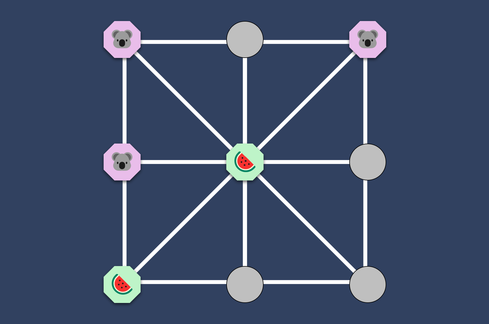

# Three Men's Morris 👾

## ▶️ Play here: [https://www.three-mens-morris.com/](https://www.three-mens-morris.com/)

Three men's morris is an abstract strategy game played on a three by three board (counting lines) that is similar to tic-tac-toe.
The winner is the first player to align their three tokens on a line drawn on the board.

Play against a friend or the computer!

The game consists of two phases

 #### 1. Phase: Placing Tokens ➰
 The board is empty to begin the game, and players take turns placing their tokens on empty intersections. Each player has three tokens.

 #### 2. Phase: Moving Tokens ➿
 Once all pieces are placed (assuming there is no winner by then), play proceeds with each player moving one of their tokens per turn.
 A token may move to any adjacent linked empty position.

## Setup

In the root project directory, run:

#### `yarn`

to install all dependencies of server and client.

(If you want to use npm you have to run `npm install` in the root project directory and in the ***client*** directory)

## Start in production

### One Server (e.g. heroku)
Run
#### `yarn build` (or `npm build`)
in the root project directory.
Run
#### `yarn start` (or `npm start`)
in the root project directory.

## Start locally

### Client
Run 
#### `yarn run start:client` (or `npm run start:client`)
in the root directory of the project to start the react app and open in under [http://localhost:3006](http://localhost:3006) to 
view it in the browser.
The page will reload if you make edits.\
You will also see any lint errors in the console.

### Server
Run 
#### `npm run dev`
in the root directory to start the backend under [http://localhost:8080](http://localhost:3000)

## AI

Collect a dataset of historical games: This dataset should include the game state at each move, the move made by the player (or the computer), and the outcome of the game (win, lose, or draw).

Preprocess the data: Prepare the data for the model by converting the game state into a format that can be used as input for the model. For example, the game state can be represented by a matrix where each cell contains a value indicating the player that has a token in that cell, or by a vector of features that describe the state of the game.

Split the data into training and testing sets: Divide the dataset into two sets, one for training the model and one for evaluating its performance.

Choose a model architecture and train it: Select a suitable model architecture, such as a neural network, and train it on the training set. The model should take the game state as input and output the best move to make.

Evaluate the model's performance: Use the testing set to evaluate the performance of the model. Compare the predictions made by the model with the actual moves made in the games, and calculate metrics such as accuracy, precision, and recall.

Fine-tune and improve the model: Based on the results obtained in step 5, you can fine-tune the model's architecture, the hyperparameters, and the dataset.

Test the model on new unseen games: Finally, test the model on new games that it has never seen before, and evaluate its performance against the current algorithm or human players.
